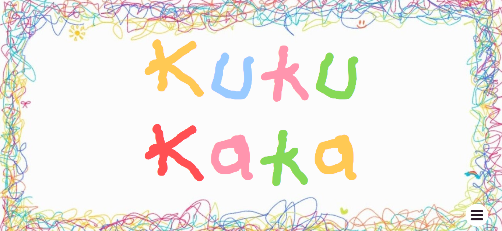

# Kuku Kaka
the word kaka means baby in hindi and since babies say "gugu gaga", i wanted to include a variation for my website. the font is named kaka font because it is written like a toddler's writing. i got inspired from my cousin brother for this website and the font. i tried to copy his writing to make the font.

Home

Guide

Test

Download

Hamburger menu

## Features
- hamburger menu with stylish hover effect
- my own custom font and hand-drawn background
- custom scrollbar for the page on which i have the guide for the font
- a page to test the font on your own text from arial to kaka font
    - the page also has two buttons to translate and clear the text
- a download page to download(obviously) the font
- the page also has the link to my github repo

## Credits
- for the (hover effect)[https://www.youtube.com/watch?v=ViAwFGjWngQ] on the menu
- for the (animation)[https://www.youtube.com/watch?v=Zp34OKr5x9g] of the button when the hamburger menu opens
- a little help from gemini for the second textarea to have the same text as the first one on button press